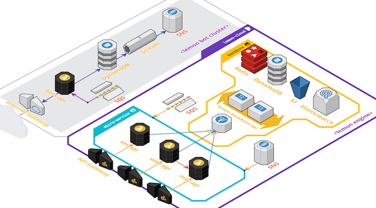

[](https://travis-ci.org/lemoncloud-io/lemon-engine)
[](https://codecov.io/gh/lemoncloud-io/lemon-engine)
[](https://badge.fury.io/js/lemon-engine)
[](https://badge.fury.io/gh/lemoncloud-io%2Flemon-engine)


# lemon-engine

Automatic Node Synchronizer between `DynamoDB` + `Redis` + `Elasticsearch` over `AWS` Cloud.

- **NOTE** 백엔드 서버에 `lemon-backend-api` 별도 실행 필요!

## Overview

- NoSQL (DynamoDB) <-> ElastiSearch <-> Redis 데이터 동기화
- DynamoDB 업데이트시 -> 업데이트 Stream 수신 -> 변경 데이터 추적 -> ES 와 동기화.



## Usage (사용법)

- install with npm `npm install lemon-engine --save`

- create internal Service with data model

```js
import engine from 'lemon-engine';

//! create engine in global scope.
const $engine = engine(global, { env: process.env });

// deefine properties.
const FIELDS = [
    'id', 'type', 'parent', 'name', ...
];
const ES_FIELDS = FIELDS;

//! config engines (as example)
const $model = $engine.createModel(`${name}`, {
    ID_TYPE         : '#STRING',        // WARN! '#' means no auto-generated id.
    ID_NEXT         : 0,                // ID Starts
    FIELDS          : FIELDS,           // Properties
    DYNA_TABLE      : 'LemonTable',     // DynamoDB Table
    REDIS_PKEY      : '#TDQ',           // '#' means no use redis, but elastic as cache.
    ES_INDEX        : 'lemons-v1',      // ES Index Name
    ES_TYPE         : 'none',           // ES Type Name (deprecated since ES6)
    ES_FIELDS       : ES_FIELDS,        // ES Fields List.
    NS_NAME         : name,             // Notify Service Name. (null means no notifications)
    ES_MASTER       : 1,                // ES Master NODE.
    ES_VERSION      : 6,                // ES Target Version (6 means 6.x)
    CLONEABLE       : true,             // Clonable with parent/cloned property.
    PARENT_IMUT     : false,            // Immutable of parent property (2018.03.15)
    ES_TIMESERIES   : false,            // As time-Series data, useful when saving time-series.
    XECURE_KEY      : 'lemon',          // (optional) Encryption Key (use '*' prefix at property name: ver 0.3.22)
});
```

- build CRUD common service functions.

```js
//! search by param
// ex) { id: 1234 } => search by `id == 1234`.
const do_search = (id, param) => {
    _log(NS, `do_search(${id})... param=`, $U.json(param));
    return $model.do_search(id, param);
};
```


## Installation (설치법)

- `lemon-backend-api` 백본 서비스 구성
- configure environment.


## 개발 (Development)

- **TODO** refer to [lemon-hello-api](https://github.com/lemoncloud-io/lemon-hello-api)


## Deploy (NPM 모듈 배포)

1. `package.json` 의 `version` 정보를 변경
1. `$ npm run publish` 실행 (단, npm 로그인 필요!)
1. [lemon-engine](https://www.npmjs.com/package/lemon-engine) 으로 배포됨.


## Contribution

Plz, request PR. See [CODE_OF_CONDUCT](CODE_OF_CONDUCT.md)


## LICENSE

[MIT](LICENSE)


----------------
# VERSION INFO #

| Version   | Description
|--         |--
| 2.2.5     | improve http-request of type+id+cmd.
| 2.2.4     | optimize log in init engine.
| 2.2.3     | hot-fix type error of `$U.dt()`.
| 2.2.2     | relay context as `that._ctx` in `on_record_update()`, and use common `BACKBONE_API` env.
| 2.2.1     | hot-fix error of `$protocol().do_execute()`.
| 2.2.0     | support enhanced type definitions.
| 2.1.8     | support `do_read_deep` for direct reading via dynamodb.
| 2.1.6     | support method `PATCH` in `web-proxy`. required `backbone#2.1.4`.
| 2.1.5     | custom web-proxy by `_$.createWebProxy()`.
| 2.1.4     | support relaying headers in `web-proxy`. required `backbone#2.1.3`.
| 2.1.0     | refactoring to typescript.
| 2.0.0     | rename to `lemon-engine`, and set to public.
